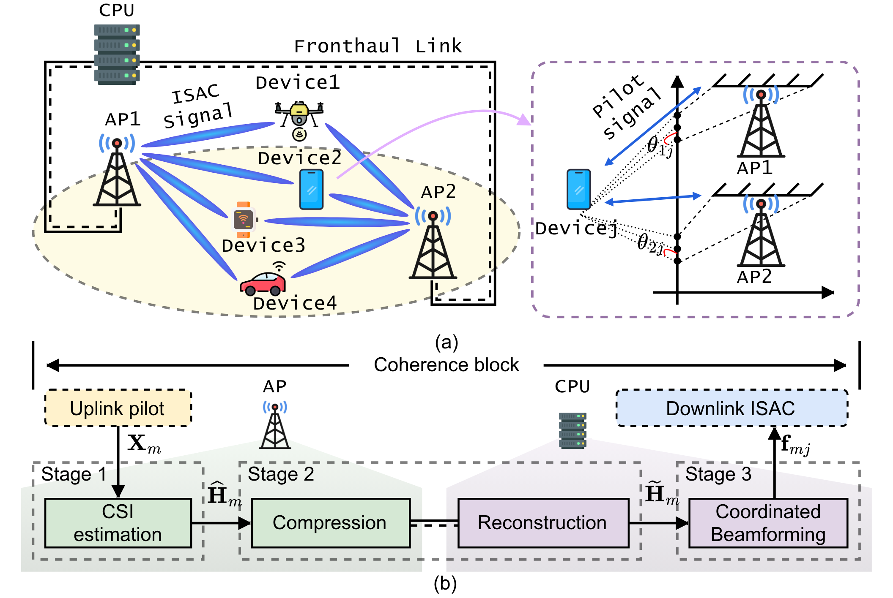
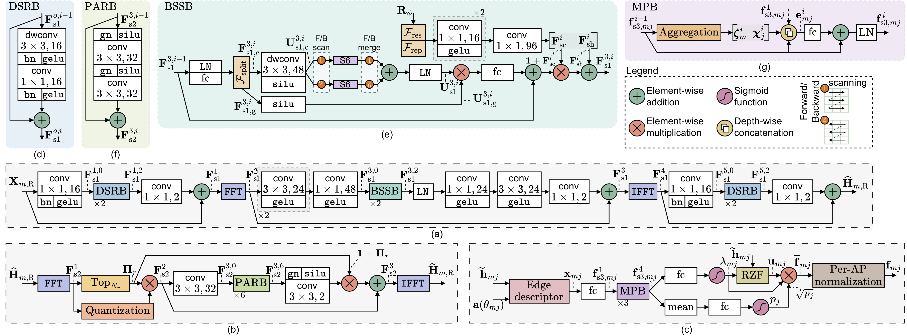

# ARBNet

Cell-free integrated sensing and communication (CF-ISAC) depends fundamentally on precise channel state information (CSI) and synchronized transmission. Unfortunately, its practical implementation is hindered by issues such as non-orthogonal pilots, limitations within the fronthaul capacity, and the propagation of CSI errors to beamforming processes. This manuscript introduces ARBNet, a comprehensive framework aimed at concurrently addressing the challenges of CSI acquisition, reconstruction, and coordinated beamforming.

In the initial phase, a hybrid fast Fourier transform combined with a state-space estimator utilizes depthwise-separable residual blocks (DSRBs) to refine data within the antenna domain. Concurrently, bidirectional selective state-space blocks (BSSBs) are employed to capture beam-domain dependencies through pilot-conditioned modulation techniques. In the subsequent phase, the framework preserves and quantizes sparse beam-domain coefficients at the access points (APs), while the central processing unit employs support-aware pre-activation residual blocks (PARBs) for CSI reconstruction. Finally, message-passing blocks (MPBs) facilitate the learning of coordination between APs and devices, as well as the assignment of device weights for implementing structured regularized zero-forcing beamforming.

Extensive simulations demonstrate that ARBNet significantly reduces the normalized mean-square errors (NMSEs) for estimation and reconstruction to levels of -6.620 dB and -5.733 dB, respectively. Moreover, it enhances the minimum communication signal-to-noise plus interference ratio (SINR) by 23.641 dB in comparison to baseline methods, all the while achieving a mean sensing signal-to-noise ratio (SNR) of 11.875 dB.

If there is any error or topic that needs to be discussed, please contact [Truong-Thinh Le](https://github.com/KrynStackk) at [letruongthinh1712@gmail.com](mailto:letruongthinh1712@gmail.com).

## Architecture

### Device-Centric CF-ISAC System Architecture

  

### Overview of ARBNet Architecture

  

